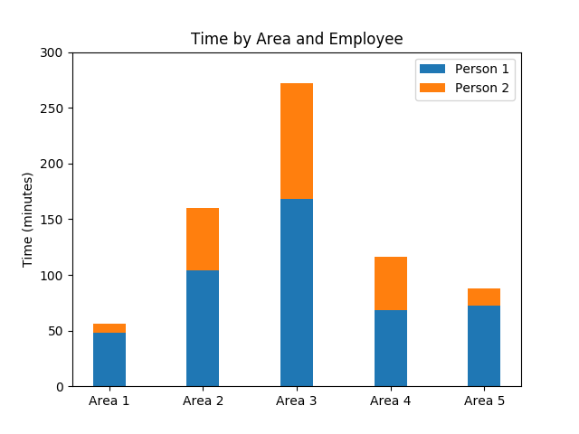
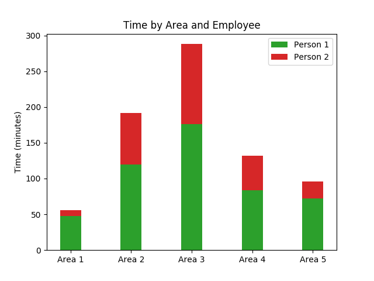
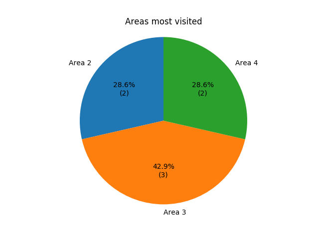
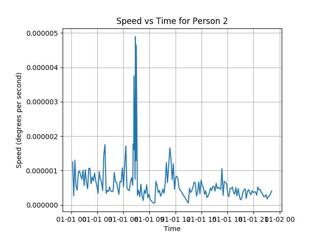

# Biarri Tech Challenge

Tech Challenge completed on behalf of Biarri.

## Installation

Use the package manager [pip](https://pip.pypa.io/en/stable/) to install the necessary requirements.

```bash
pip install -r requirements
```

## Usage

Replace "tech_challenge_locations.csv" with the location of the csv file that contains the employee location data. 

The "POIS" folder contains the relevant information on the areas of interest in a .shp form. Can also be changed if necessary.

```bash
python main.py tech_challenge_locations.csv --aoi ./POIS/
```

## Assumptions

While building this system, a couple assumptions were made. They are listed below:

- The time stayed in an area starts when it is first recorded and ends at the first time when they are recorded no longer within that area.
- Nearness Factor for the area is 0.1 times the size of the current area on all sides. This is variable and can be changed in the code.
- Speed calculation are only done for "Person 2" - Remove the if statement within the code to enable for all employees.

## Future Improvements

- The ability to pick and choose what function can be run based upon what questions need to be answered. Currently they are all run, but could be implemented to pass other arguments from the command line to induce these.
- The ability to pass the Nearness Factor in from the command line.
- Currently the Speed is measured in degrees rather than a standard unit like Kilometres or metres.

## Answers to Challenge Questions:

#### 1. Which areas do workers spend the most time in?
The area that workers spend the most time in is Area 3. As you can see by the graph below, Person 1 and Person 2 both spent their most time in Area 3.



#### 2. Can you tell if a reading is “near” an area? In which areas are they spending the most time in ​or​ near?
By enlargening the area by a controlled factor, I was able to determine which areas the employees spend more time near rather than in. This could allow for compensation in anomolies of locational data when points are near edges.

The graph below shows the time per area when the areas of interest are enlargened by 0.1 times their original size. In comparison to the graph in question 1, we can see that the time spent in all areas rose but noticebly within Area 2.



#### 3A. Can you tell which areas are visited the most often?
Taking a visit as a multiple readings in the same area, the graph below shows the areas that are most visited. 



#### 3B. Can you determine their speed?
To determine the speed of employee 2 (as it was informed employee 1's data isn't sufficient for this task), you can calculate the distance utilising the X and Y coordinates and take that over time. This however leaves a flaw in that the speed is in longitudinal/latitudinal degrees/second rather than kilometres/hr or metres/hr.

Below is a graph showcasing the speed of Employee 2:



#### 3C. Is there any other information you can derive from the dataset that could be useful for the client?
Another source of possible information for the client would be along the lines of whether 2 employees are within the same area which could mean a sign of meeting. By checking the time that the employees are within the same area, it could be concluded that they are infact meeting.

#### 3D. What sorts visualisations could you use to display relay the answers to these questions to the client?
As you can see by the above answers, there are a number of different visualisation methods for displaying the resulting data. These are only a few quick examples that were implemented. Others could involve more complex solutions like a heatmap on top of google map data or a trail on a map showing an employees path.

